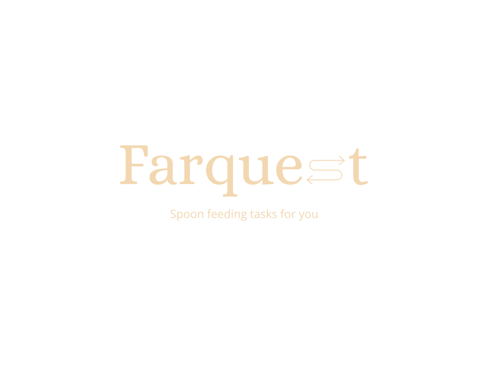

# Farquest

[](http://commitizen.github.io/cz-cli/)



A AWS lambda to kick off a AWS Fargate Task with a custom payload,retrieve it's response, and close the task afterwards.

## Running locally

- Clone the repository

- Install the depedencies running:
  
  ```bash
  npm i
  ```

- Create your custom `.env` file following the example provided `.env.example`

- Execute the handle function by running:

    ```bash
    node -e 'require("./src/index.js").handler(null, yourPayload)'
    ```

    > Just to be explicit, replace "yourPayload" with anything you want to send to your Fargate task

## Running in AWS Lambda

- Configure your environment variables

- Hit your lambda with a request

- Profit
